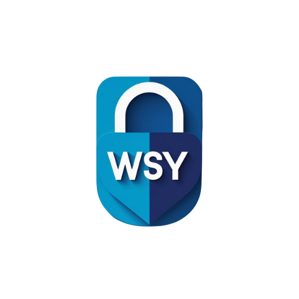

# 🔐 WSY - Web Şifre Yöneticisi

Modern, güvenli ve kullanıcı dostu şifre yönetim sistemi. Tüm şifreleriniz end-to-end şifreleme ile korunur ve sadece sizin bilgisayarınızda saklanır.



## ✨ Özellikler

- 🔒 **Güvenli Şifreleme**: Fernet şifreleme algoritması ile end-to-end şifreleme
- 🗂️ **Kategori Sistemi**: Şifrelerinizi kategorilere ayırarak düzenli yönetim
- 🎯 **Şifre Gücü Analizi**: Şifrelerinizin gücünü analiz edin
- 🛡️ **Hesap Güvenliği**: Yanlış giriş denemelerine karşı otomatik hesap kilitleme
- 💾 **Yerel Veri Saklama**: Tüm veriler yerel SQLite veritabanında saklanır
- 🎨 **Modern Arayüz**: Temiz ve kullanıcı dostu web arayüzü
- 🔑 **Şifre Sıfırlama Sistemi**: 3 farklı kurtarma yöntemi ile güvenli şifre sıfırlama
- 🔐 **Kurtarma Yöntemleri**: Güvenlik soruları, kurtarma anahtarı ve anahtar dosyası
- 🎲 **Şifre Oluşturucu**: Güçlü ve rastgele şifreler oluşturun
- 📊 **İstatistikler**: Şifre istatistiklerinizi görüntüleyin
- 🔍 **Arama ve Filtreleme**: Şifrelerinizi kolayca bulun
- 📤 **Dışa/İçe Aktarma**: Şifrelerinizi yedekleyin ve geri yükleyin
- ✅ **Anlık Kullanıcı Adı Kontrolü**: Kayıt sırasında kullanıcı adının müsait olup olmadığını anında kontrol edin
- 🔄 **Otomatik Veritabanı Migration**: Veritabanı şeması otomatik olarak güncellenir

## 🚀 Kurulum

### Gereksinimler

- Python 3.7 veya üzeri
- Windows İşletim Sistemi

### Kurulum Adımlarıı

1. **Projeyi İndirin**
   ```bash
   # GitHub'dan klonlayın veya ZIP olarak indirin
   git clone https://github.com/kullaniciadi/WSY.git
   cd WSY
   ```

2. **Kurulumu Başlatın**
   - `kurulum.bat` dosyasını çift tıklayarak çalıştırın
   - Kurulum scripti tüm gerekli adımları otomatik olarak gerçekleştirecektir

3. **Uygulamayı Başlatın**
   - Proje klasöründeki `WSY.bat` dosyasını çift tıklayın
   - Uygulama otomatik olarak tarayıcıda açılacaktır

4. **Kullanmaya Başlayın**
   - Uygulama otomatik olarak tarayıcıda `http://127.0.0.1:5000` adresinde açılacaktır
   - Yeni bir hesap oluşturun ve şifrelerinizi yönetmeye başlayın!

## 📖 Kullanım

### İlk Kullanım

1. Ana sayfada **"Kayıt Ol"** butonuna tıklayın
2. **Kullanıcı Adı**: Kullanıcı adınızı girin (en az 3 karakter). Sistem otomatik olarak müsait olup olmadığını kontrol eder.
3. **E-posta**: E-posta adresinizi girin
4. **Ana Şifre**: Güçlü bir ana şifre oluşturun (min. 8 karakter)
5. **Şifre Sıfırlama Yöntemi Seçin**: En az bir kurtarma yöntemi seçmelisiniz:
   - **Güvenlik Soruları**: 3 güvenlik sorusu seçin ve cevaplayın
   - **Kurtarma Anahtarı**: Benzersiz bir kurtarma anahtarı alın (format: `XXXX-XXXX-XXXX-XXXX`)
   - **Anahtar Dosyası**: Güvenli bir JSON dosyası indirin
6. Kayıt işlemini tamamlayın ve kurtarma bilgilerinizi kaydedin
7. Giriş yapın ve şifrelerinizi yönetmeye başlayın

### 🔑 Şifre Sıfırlama Sistemi

WSY, şifrenizi unuttuğunuzda hesabınıza erişmenizi sağlayan 3 farklı kurtarma yöntemi sunar:

#### 1. 🔐 Güvenlik Soruları
- Kayıt sırasında 3 güvenlik sorusu seçin ve cevaplayın
- Şifre sıfırlama sırasında **tüm 3 soruyu doğru cevaplamanız** gerekir
- Cevaplar büyük/küçük harf duyarsızdır
- Örnek sorular:
  - Annenizin doğduğu şehir neresidir?
  - İlk evcil hayvanınızın adı neydi?
  - En sevdiğiniz filmin adı nedir?

#### 2. 🔑 Kurtarma Anahtarı (Recovery Key)
- Kayıt sırasında benzersiz bir kurtarma anahtarı oluşturulur
- Format: `XXXX-XXXX-XXXX-XXXX` (16 karakter, büyük harf ve rakam)
- Bu anahtarı güvenli bir yerde saklayın
- Şifre sıfırlama sırasında bu anahtarı girerek şifrenizi sıfırlayabilirsiniz
- Anahtar otomatik olarak formatlanır (her 4 karakterden sonra tire eklenir)

#### 3. 📄 Anahtar Dosyası (Key File)
- Kayıt sırasında güvenli bir JSON dosyası oluşturulur
- Bu dosyayı güvenli bir yerde saklayın
- Şifre sıfırlama sırasında bu dosyayı yükleyerek şifrenizi sıfırlayabilirsiniz

#### ⚠️ Önemli Notlar
- En az bir kurtarma yöntemi seçmelisiniz (hepsini seçebilirsiniz)
- Kurtarma bilgilerinizi kaydedin! Bunları kaybederseniz hesabınıza erişemezsiniz
- Şifre sıfırlandığında, güvenlik nedeniyle tüm kayıtlı şifreleriniz silinir
- Şifre sıfırlama sonrası yeni şifreler eklemeniz gerekecek

### Şifre Ekleme

1. Giriş yaptıktan sonra **"Şifre Ekle"** butonuna tıklayın
2. Site adı, kullanıcı adı ve şifreyi girin
3. Kategori seçin (isteğe bağlı)
4. Şifre gücü otomatik olarak analiz edilir
5. **"Kaydet"** butonuna tıklayın

### Şifre Yönetimi

- **Görüntüleme**: Şifrelerinizi görmek için **"Göster"** butonuna tıklayın
- **Kopyalama**: Şifreyi kopyalamak için **"Kopyala"** butonuna tıklayın
- **Düzenleme**: Şifreyi düzenlemek için **"Düzenle"** butonuna tıklayın
- **Silme**: Şifreyi silmek için **"Sil"** butonuna tıklayın

## 🔧 Yapılandırma

Uygulama, `.env` dosyası üzerinden yapılandırılır. Bu dosya kurulum sırasında otomatik olarak oluşturulur.

### .env Dosyası

```env
# Gizli anahtar - Rastgele uzun bir string oluşturun
SECRET_KEY=default_secret_key_lutfen_degistirin_cok_uzun_olsun

# Uygulama Salt - Şifreleme için kullanılır
APP_SALT=gL6G4wWp0cTjK5q9VfB2zXyN7eU1sC3a
```

**Önemli**: Production kullanımı için `SECRET_KEY` ve `APP_SALT` değerlerini mutlaka değiştirin!

## 🛠️ Teknolojiler

- **Python 3.7+**: Programlama dili
- **Flask**: Web framework
- **SQLite**: Veritabanı
- **Cryptography**: Şifreleme kütüphanesi
- **Flask-Login**: Kullanıcı oturum yönetimi
- **Flask-SQLAlchemy**: ORM
- **HTML5/CSS3/JavaScript**: Frontend

## 📦 Bağımlılıklar

Tüm bağımlılıklar `requirements.txt` dosyasında listelenmiştir:

```
Flask==3.1.1
Flask-Login==0.6.3
Flask-SQLAlchemy==3.1.1
cryptography==45.0.5
python-dotenv==1.1.1
SQLAlchemy==2.0.41
Werkzeug==3.1.3
```

## 🔒 Güvenlik

WSY, kullanıcı verilerinin güvenliğini en üst seviyede tutmak için çeşitli güvenlik önlemleri içerir:

- **End-to-End Şifreleme**: Tüm şifreler kullanıcının ana şifresi ile türetilen anahtarlar kullanılarak şifrelenir
- **PBKDF2**: Ana şifre türetme için PBKDF2 algoritması kullanılır (100.000 iterasyon)
- **Fernet Şifreleme**: Şifreler için Fernet symmetric encryption kullanılır
- **Hesap Kilitleme**: Yanlış giriş denemelerine karşı otomatik hesap kilitleme
- **Yerel Veri Saklama**: Tüm veriler yerel SQLite veritabanında saklanır

## ⚠️ Önemli Notlar

- **Ana Şifrenizi Asla Unutmayın**: Ana şifreniz olmadan şifrelerinize erişemezsiniz
- **Kurtarma Bilgilerinizi Kaydedin**: Kurtarma anahtarı, key file veya güvenlik soruları yanıtlarınızı güvenli bir yerde saklayın
- **Yedekleme**: Veritabanı dosyasını (`users_and_passwords.db`) düzenli olarak yedekleyin
- **Güvenlik**: Production kullanımı için `.env` dosyasındaki `SECRET_KEY` ve `APP_SALT` değerlerini mutlaka değiştirin
- **Kullanıcı Adı Kontrolü**: Kayıt sırasında kullanıcı adı otomatik olarak kontrol edilir, müsait olmayan kullanıcı adları kabul edilmez

## 📝 Lisans

Bu proje MIT lisansı altında lisanslanmıştır.

## 📧 İletişim

Sorularınız veya sorunlarınız için GitHub repository'sinde issue açabilirsiniz.
Benimle iletişime de geçebilirsiniz https://www.linkedin.com/in/yusuf-duhan-%C5%9Fahin-a2b406352/ :)

## 🙏 Teşekkürler

- Flask topluluğuna
- Açık kaynak topluluğuna
- Tüm katkıda bulunanlara

---

**Not**: Bu uygulama geliştirme amaçlıdır. Production kullanımı için ek güvenlik önlemleri alınması önerilir.


